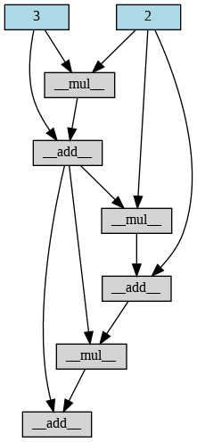
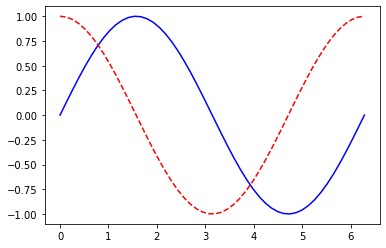
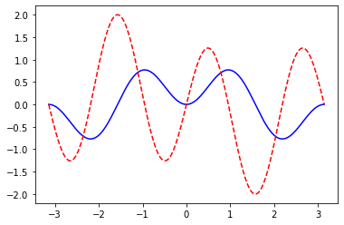

# utorch
[](https://colab.research.google.com/drive/1inbkBq9MPUn3O01JOhMj50O4iClOGazK?authuser=1)


**utorch** is a minimal implementation of [pytorch](https://github.com/pytorch/pytorch/tree/f5b68e74d75c38d5e2044fc6b62112181080bb3f) and [autograd](https://github.com/HIPS/autograd).
The idea was to create an **understandable** version of the deep learning framework, which means its code should be easy to follow even for someone who has no prior existence in machine learning, thus making it perfect for educators. To fulfill this requirement utorch supports the following features:

* simplegrad - automatic differentiation library that supports some predefined differentiable tensor operations
* neural network - a set of tools that allows to build and train neural networks. Those tools mimic the interface of PyTorch, so if you are familiar with PyTorch, then you are ready to go with utorch as well.   
* utils - this library contains a set of tools that can be used to visualize the computational graphs. 

Features that are intentionally not supported: 

* GPU/TPU support. We would like to reduce the complexity of the code, providing python only implementation. Thus, we don't want to contaminate the code by adding c++ classes. However, if you have an idea on how to add this feature without changing the philosophy of this library please let us know. 


## simplegrad

simplegrad is a tool that allows to generate computational graphs and automatically differentiate native Python and Numpy code. It can handle a large subset of Python's features, including loops, ifs, and recursion. In the future, it will take derivatives of derivatives of derivatives. It supports reverse-mode differentiation (a.k.a. backpropagation), which means it can efficiently take gradients of scalar-valued functions with respect to array-valued arguments. 

If you are interested in the theory behind reverse-mode auto differentiation please take some time to read this remarkable [phd thesis](https://dougalmaclaurin.com/phd-thesis.pdf). 

TODO add a tutorial on how the simplegrad is implemented. 

### Examples: 

#### Dynamic computational graphs generation
simplegrad allows creating a computational graph that represents all processing specified by a given python code, regardles on how complex it can be. 

```python
a =  Variable(2)
b = Variable(3)
for i in range(3):
  if i%2 == 0:
    b += a*b
  else:
    a += a*b
draw_graph(b)
```



and something a little bit more complicated 
```python
def fib(n):
  if n == 0 or n ==1:
    return n
  return fib(n-1)+fib(n-2)

n = Variable(10)
b = fib(n)
```


#### Automatic derivative calculation 
The main purpose of this package is the ability to calculate the derivative of the scalar input with respect to the n-dim vector input. 
In the literature, it is called reverse-mode differentiation. A more detailed explanation of this idea will be added soon. In the meantime, for more information, please refer to [this paper](https://arxiv.org/pdf/1811.05031.pdf).  

From the user perspective, in order to calculate derivative one need to cal the method **backward()**, see examples below. To make sure, that the simplegrad returns the correnct answer, we compare it with the one given by PyTorch. 

Example 1: Simple expression composed of sums and multiplications 

```python
a =  Variable(2)
b = Variable(3)
d = Variable(4)
c = a*a*b+d+d*a*b+a*a*2
c.backward()
print(a.grad.value, b.grad.value, d.grad.value)
```

```text
(32, 12, 7)
```

```python
A = torch.tensor(2., requires_grad=True)
B = torch.tensor(3.,requires_grad=True)
D = torch.tensor(4.,requires_grad=True)
C = A*A*B+D+D*A*B+A*A*2


C.backward()
print(A.grad, B.grad, D.grad)
```

Example 2: 2D tensor manipulation: 
```python
# simplegrad implementation
np.random.seed(10)
d = Variable(np.random.normal(1,10,size=(2,3)))
w = Variable(np.random.normal(1,10,size=(10,3)))
b = Variable(np.random.normal(1,10,size=(10)))
c = Variable.sum(d@Variable.transpose(w)*b)

c.backward()
print("d grad ",d.grad.shape(), d.grad.value,)
print("w grad ",w.grad.shape(), w.grad.value,)
print("b grad ",b.grad.shape(), b.grad.value,)
draw_graph(c)
```

```text
d grad  (2, 3) [[-115.06495011    6.3034526  -265.32755501]
 [-115.06495011    6.3034526  -265.32755501]]
w grad  (10, 3) [[  76.19211818   76.86301452 -103.31766542]
 [ -36.19622066  -36.51494014   49.08262304]
 [ 206.61821525  208.43755574 -280.17742705]
 [ -96.26176228  -97.10937836  130.53240658]
 [ 115.79867166  116.81831658 -157.02475139]
 [ -38.21287309  -38.54934985   51.81723426]
 [-127.86271216 -128.98858487  173.3837729 ]
 [ -59.30394821  -59.82613874   80.41705135]
 [-107.3235098  -108.26852816  145.53230364]
 [ -17.16613424  -17.31728763   23.27753784]]
b grad  (10,) [  66.17945244 -198.59804888  -26.2728396  -124.81752913  478.64093321
 -707.33450232  417.64276678   54.54966854 -142.59286261   98.19945202]
```

```python
#pytorch implementation 
np.random.seed(10)
D = torch.tensor(np.random.normal(1,10,size=(2,3)), requires_grad=True)
W = torch.tensor(np.random.normal(1,10,size=(10,3)), requires_grad=True)
B = torch.tensor(np.random.normal(1,10,size=(10)),requires_grad=True)

C = torch.sum(D@W.T*B)

C.backward()

print("d grad ",D.grad.shape, D.grad,)
print("w grad ",W.grad.shape, W.grad,)
print("B grad ",B.grad.shape, B.grad,)
```
```text
d grad  torch.Size([2, 3]) tensor([[-115.0650,    6.3035, -265.3276],
        [-115.0650,    6.3035, -265.3276]], dtype=torch.float64)
w grad  torch.Size([10, 3]) tensor([[  76.1921,   76.8630, -103.3177],
        [ -36.1962,  -36.5149,   49.0826],
        [ 206.6182,  208.4376, -280.1774],
        [ -96.2618,  -97.1094,  130.5324],
        [ 115.7987,  116.8183, -157.0248],
        [ -38.2129,  -38.5493,   51.8172],
        [-127.8627, -128.9886,  173.3838],
        [ -59.3039,  -59.8261,   80.4171],
        [-107.3235, -108.2685,  145.5323],
        [ -17.1661,  -17.3173,   23.2775]], dtype=torch.float64)
B grad  torch.Size([10]) tensor([  66.1795, -198.5980,  -26.2728, -124.8175,  478.6409, -707.3345,
         417.6428,   54.5497, -142.5929,   98.1995], dtype=torch.float64)
```

#### Visualize 1D function and its 1st derivative:

```python
def plot_function_and_der(fun, range=[0,1], n_points=100):

  def evaluate_derivative(x, fun):
    x_var = Variable(x)
    y = fun(x_var)
    y.backward()
    return y.value, x_var.grad.value

  x_points = np.linspace(start = range[0], stop=range[1], num=n_points)
  y = np.transpose(np.array(list(map(lambda x: evaluate_derivative(x, fun), x_points))))
  plt.plot(x_points, y[0], color='blue')
  plt.plot(x_points, y[1], color='red', linestyle='dashed')

```

```
plot_function_and_der( Variable.sin, range=[0,2*np.pi], n_points=50)
```



```
plot_function_and_dev(lambda x: Variable.sin(x)*Variable.cos(x), range=[-np.pi,np.pi], n_points=1000)
```


```
plot_function_and_dev(lambda x: Variable.sin(x)*Variable.sin(x*2), range=[-np.pi,np.pi], n_points=1000)
```




# Contribution

You are more than welcome to contribute to this software. If you plan to contribute new features, utility functions, or extensions to the core, please first open an issue and discuss the feature with us. 
Please keep in mind the purpose of this software is to provide *understandable* implementation of the Deep Learning framework. We don't want to compete with pytorch, jax or tensorflow. Our goal is to give students and ML practitioners source code that they can leverage to get a better feeling on how general DL framework works. 


# Citation

``` 
@software{utorch,
  author = {Adam Dendek},
  title = {{utorch}: a minimal implementation of autograd and pytorch},
  url = {https://github.com/adendek/utorch
  version = {0.1},
  year = {2021},
}

```
